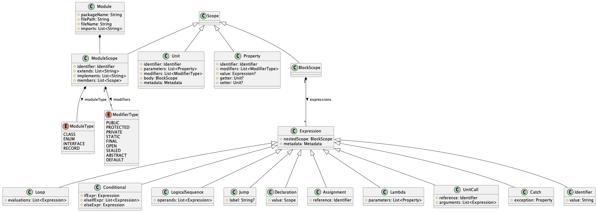

# LAMP Framework 💡
### A Language-Agnostic Multi-Paradigm Code Quality Assurance Framework
This git repository contains the prototype of the LAMP Framework.
This framework is created as proof for the concepts described in my thesis written to receive my MSc title in Computer Science from the University of Twente.
See the paper ["Language-agnostic multi-paradigm code quality assurance framework"](https://ceur-ws.org/Vol-3245/) published in CEUR-WS Vol. 3245 to read about the preliminary research done to design this framework.
The final version of this framework and thesis is still a work in progress.

### Terminology
- **Project**: a compilable bundle of components and/or modules without a component
- **Component**: a package containing one or more modules, or other packages
- **Module**: a class, interface, enum class or record class
- **Unit**: packet of work, meaning a function, method or lambda

### Framework Flow

```
(1)              Project Code                =(using)=>  Compiler API                 =(outputs)=>    An Abstract Syntax Tree model per module
(2)  For every:  AST model                   =(using)=>  XML schema                   =(outputs)=>    Metamodel XML document
(3)  For every:  Metamodel XML document      =(using)=>  JAXB Unmarshalling           =(outputs)=>    Module Metamodel instance
(4a) For every:  Module Metamodel instance   =(using)=>  ModuleMetricVisitor(s)       =(outputs)=>    Module Metrics (WMC, CWMC)
(4b) For every:  Module Metamodel instance   =(using)=>  UnitMetricVisitor(s)         =(outputs)=>    Unit Metrics (CC, COCO, NOP, LOL, LC)
(5)  For all:    Module Metamodel instances  =(using)=>  InheritanceTreeVisitor       =(outputs)=>    Inheritance Tree of project modules 
(6)              Inheritance Tree            =(using)=>  InheritanceMetricVisitor(s)  =(outputs)=>    Inheritance Metrics (DIT, NOC)
(7)  For all:    Module Metamodel instances  =(using)=>  SemanticTreeVisitor          =(outputs)=>    Semantic Tree of project
(8)              Semantic Tree               =(using)=>  SemanticMetricVisitor(s)     =(outputs)=>    Semantic Metrics (CBO, MLF, RFC, DEAD, LSE, LCOM)
```

### Metric Overview
[//]: # (TODO: Explain all metrics.)


## Development

### System requirements
**System libraries**:
- Graphviz (required for PlantUML)

**Intellij plugins**:
- Jakarta EE (requires IDEA Ultimate)
- PlantUML


### Metamodel development (with XSD)
The metamodel is created using the XML Schema Definition (XSD) language.
The metamodel XML schema is located in `src/main/resources`. 
During the development of our metamodel, we went through multiple iterations, which correspond to XSD versions (v1, v2, etc.).

Additionally, the `metamodel-bindings.xjb` file is used to define global bindings to the schema, such as the package name that will be defined for every generated class.

### Metamodel Class Diagram


### Metamodel POJO Generation (with JAXB)
We use [JAXB 3.0](https://jakarta.ee/specifications/xml-binding/3.0/jakarta-xml-binding-spec-3.0.html) to generate POJOs conforming to the XSD schema.

We use the [visitor pattern](https://refactoring.guru/design-patterns/visitor), similar to how ANTLR handles AST traversals, to traverse the generated objects we marshal from our XML documents. 
The visitor base class is generated using the library [jaxb-visitor](https://github.com/massfords/jaxb-visitor).
Using the command `mvn jaxb30:generate`, we can generate the Metamodel classes and the Visitor base classes.

The generated metamodel code is located at `target/generated-sources/xjc/nl.utwente.student.metamodel.vN`.
The generated visitor is located at `target/generated-sources/xjc/nl.utwente.student.visitor`.

### Inheritance Tree
[//]: # (TODO: Explain how it looks and works.)

### Semantic Tree
[//]: # (TODO: Explain how it looks and works.)


### Generating Transformers
#### ANLTR4 - Java Grammar
```
antlr -o target/generated-sources/antlr4 -lib src/main/resources/grammars/java -visitor -listener -package nl.utwente.student.visitor.java -Werror
```

## Usage of the TUI
### Running for Git Projects
See the Java Example Project [here](https://github.com/MarnickvdA/LAMP-Java17.git).