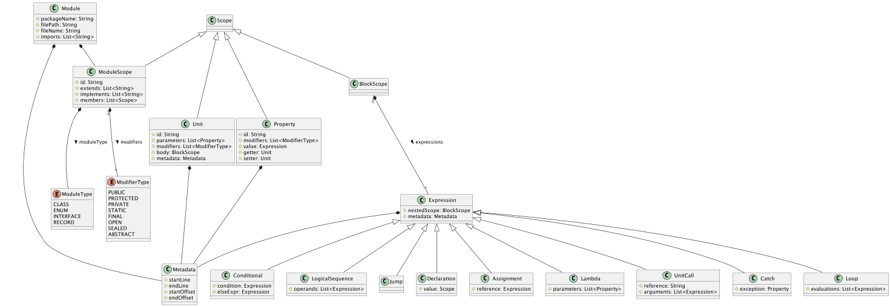

# Language-Agnostic Multi-Paradigm Code Quality Assurance Framework
This git repository contains the prototype of the LAMP Framework.

### System requirements
**System libraries**:
- Graphviz (required for PlantUML)

**Intellij plugins**:
- Jakarta EE (requires IDEA Ultimate)
- PlantUML

### Terminology
- **Project**: a compilable bundle of components and/or modules without a component
- **Component**: a package containing one or more modules, or other packages
- **Module**: a class, interface, enum class or record class
- **Unit**: packet of work, meaning a function, method or lambda

### Metamodel (XML Schema)
The metamodel is created using the XML Schema Definition (XSD) language.
The metamodel XML schema is located in `src/main/resources`. 
During the development of our metamodel, we went through multiple iterations, which correspond to XSD versions (v1, v2, etc.).

Additionally, the `metamodel-bindings.xjb` file is used to define global bindings to the schema, such as the package name that will be defined for every generated class.

### Metamodel Class Diagram


### Code Generation (JAXB)
We use [JAXB 3.0](https://jakarta.ee/specifications/xml-binding/3.0/jakarta-xml-binding-spec-3.0.html) to generate POJOs conforming to the XSD schema.

We use the [visitor pattern](https://refactoring.guru/design-patterns/visitor), similar to how ANTLR handles AST traversals, to traverse the generated objects we marshal from our XML documents. 
The visitor base class is generated using the library [jaxb-visitor](https://github.com/massfords/jaxb-visitor).
Using the command `mvn jaxb30:generate`, we can generate the Metamodel classes and the Visitor base classes.

The generated metamodel code is located at `target/generated-sources/xjc/nl.utwente.student.metamodel.vN`.
The generated visitor is located at `target/generated-sources/xjc/nl.utwente.student.visitor`.

## Transformations
### Java
ANTLR Visitor code generation: 
```
antlr -o target/generated-sources/antlr4 -lib src/main/resources/grammars/java -visitor -listener -package nl.utwente.student.visitor.java -Werror
```

### Application Flow

```
(1)             Project Code                =(using)=>  Compiler API         =(outputs)=>    An Abstract Syntax Tree model per module
(2) For every:  AST model                   =(using)=>  XML schema           =(outputs)=>    Metamodel XML document
(3) For every:  Metamodel XML document      =(using)=>  JAXB Unmarshalling   =(outputs)=>    Module Metamodel instance
(4) For every:  Module Metamodel instance   =(using)=>  JAXB Visitor         =(outputs)=>    Metrics
```